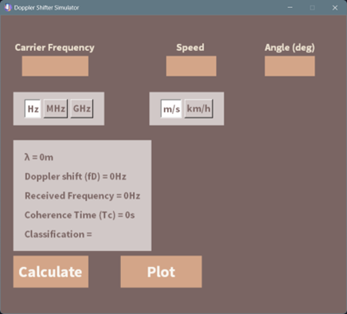
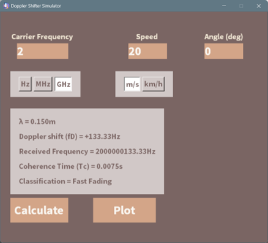
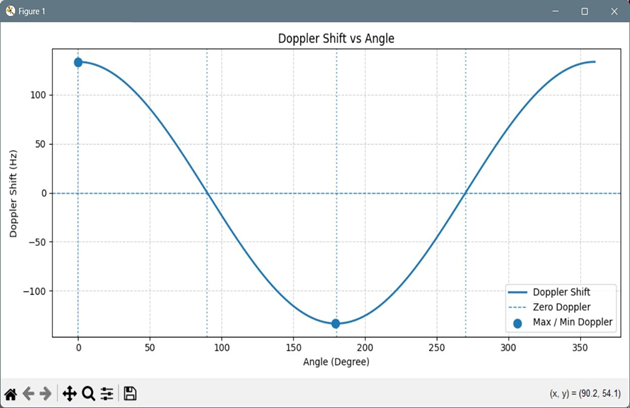
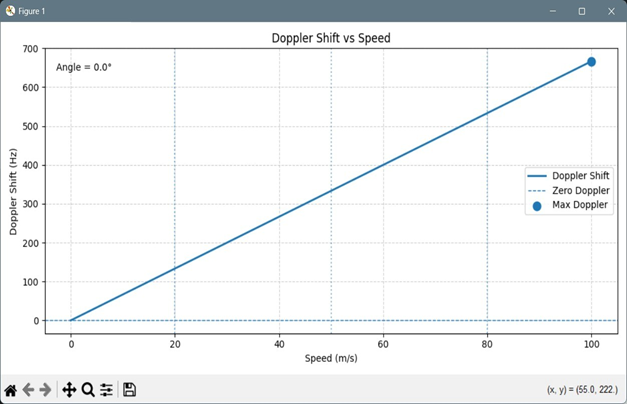

# **Doppler Shift Simulator**

This project is a Python-based Doppler Shift simulator with a graphical user interface (GUI).

It allows users to calculate Doppler shift parameters and visualize their behavior using plots.

## **Requirements**
```bash
# installing required libraries.
pip install numpy matplotlib
```

## **How to Use the Application**
1- Enter the Carrier Frequency.

2- Select the frequency unit (Hz, MHz, GHz)

3- Enter the Speed.

4- Select the speed unit (m/s, km/h)

5- Enter the Angle (0 – 360 degrees).

6- Click Calculate to display the results.

7- Click Plot to display Doppler Shift graphs.

## **Output Information**
#### After clicking Calculate, the following values are displayed:

Wavelength (λ)

Doppler Shift (fD)

Received Frequency

Coherence Time (Tc)

Channel Classification (No Fading / Slow Fading / Fast Fading)

## **Plots**
#### The Plot button generates two figures:

Doppler Shift vs Angle

Doppler Shift vs Speed

## **Screenshots**
### GUI


### Plots


